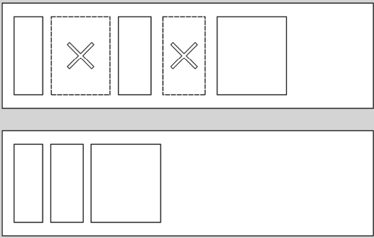

# Java Memory Management - Notes
Notes from "Java Memory Management" by Maaike van Putten, Seán Kennedy. Packt Publishing

# References
- https://learning.oreilly.com/library/view/java-memory-management/9781801812856/
- https://www.amazon.com/Java-Memory-Management-comprehensive-collection/dp/1801812853

# 1. Different Parts of the Java Memory


The Runtime data areas is essentially the Java memory; which is managed by JVM for executing code.

Runtime data areas:
1. The stack
    1. Contains a stack for each thread. Primitives and reference variables to heap are stored in the stack. Each method call results in a stack frame being created in the stack. This frame contains values for the method. A thread can only access it's own stack.
2. The heap
    1. The heap is used for dynamic memory allocation of instances of object at runtime. The heap is managed and cleaned up by garbage collection
3. The method area/Metaspace
    1. Class's metadata is stored here. It used to be called PermGen (permanent generation). All threads share this method area. It contains the runtime code, constants, static variables & constructor code
4. The runtime constant pool
5. The program counter register
    1. Each thread has it's own PC register (Call stack) which tells what code is being executed by holding the address of the instruction that's being executed. A separate PC for each thread allows concurrent execution of the same code
6. The native method stack
    1. Also known as the C stack for invoking native methods
## Creating variables in Java
- Primitives and reference variables are stored on the stack. The actual object is stored on the heap
## Variables on the stack
- Variables used in methods are stored on the stack.
- Stack memory is used for executing methods
- Each method call results in a stack frame being created in the stack memory; so the stack consists of frames corresponding to method invocations.
- When the method is finished; the stack is removed
- When stack memory is too low `StackOverFlowError` is thrown
- When a new stack cannot be allocated; `OutOfMemoryError` is thrown
- Top frame of the stack corresponds to the currently executing method; and is called the current frame
### Inside a stack/method frame


A stack frame has the following components
#### Local variable array
- The array length of the local variables array is set at compile time
- The array has single & double spots; single for int, short, char, float, byte, boolean & reference. Double for long & double (64bits)
- For instance methods (non-static); index 0 is always the reference to the object they exist on (`this`). Parameters given to the method start from index 1
- For static methods; there's no reference to an instance
#### Operand stack
- Stores operands for method calls & execution
#### Frame Data
- Contains reference to constant pool, how to return a method normally; and how to return abruptly completed methods (exceptions)

## Storing objects on the heap
- Objects can be created and stored on the heap using the new keyword. References to these objects are stored in the stack
- The objects contains primitive values & references to other objects on the heap
- When the heap is full and new object cannot be created, `OutOfMemoryError` is thrown
## Metaspace
- Holds the class metadata necessary for runtime (from Java SE 7)
- It used to be called PermGen
- Contains
    - Klass structure
    - Bytecode of methods
    - The constant pool
    - Annotations & more

# 2. Primitives & Objects in Java Memory
## Primitives on the stack & heap
- Instance primitive variables (members of the class) are stored on the heap
- Local variables to methods are stored on the stack
## Objects on the heap
- References can also be stored on either the heap or the stack (local variables array on the stack frame); depending on whether the reference is a instance variable or a local method variable
- We cannot create objects of `abstract` classes & `interface`. The references of these types always point to objects which implement them
### Objects
- String objects are stored in a special area on the heap called the String Pool (AKA String Constant Pool)
## Escaping References Security Issue
### Java's Call by value mechanism
- Whenever a method is called, the passed arguments are copied and put into the new stack frame created for the method
- The primitive variables' copies are local to the stack frame; where as reference variable copies would still point to the same object on the heap (since it's a reference)
- Therefore any change inside the called method
    - To primitives would not reflect outside to the calling method
    - To references would be reflected outside to the calling method

### Escaping References


- Even though StringBuilder is private to the person class; but due to the reference being passed around different scopes (because of call-by-value); other objects are also able to change it's value. Essentially everyone holds reference to the same object
- This is primarily because StringBuilder is mutable; in contrast to String which is immutable
- The wrapper types (Double, Long, Integer) are also immutable
#### Solution to Escaping Reference problem
- The solution revolves around `defensive copying`; where we copy the incoming (passed object) and the outgoing (returned object) for any mutable objects
- The solution is to copy the contents of the passed object into a new object and store the reference to that new object. This is knows as `Deep Copying`; as against shallow copying (done by call-by-value for references)


```
Manage object references with care. If not managed properly, you could end up with _escaping references_. 
Java uses call-by-value, which means a copy is made of the argument passed or returned. 
Depending on whether the argument is a primitive or reference, it can have major implications. 
If it’s a copy of a reference to a mutable type, then the calling code can change your supposedly **private** data. This is not proper encapsulation.
```

# 3. Zooming in on the Heap Space
## Different generations on the heap
The heap space consists of two different memory areas:
- Young generation space
- Old generation (tenured) space
  

### Garbage Collection Roots (GC roots)
GC roots are special types of objects not eligible for GC. All objects approachable by GC roots are also ineligible for GC (called live objects). Common GC roots are:
- Local variables on the stack
- All active Java threads
- Static variables (can be referenced by Class)
- JNI references
## Heap spaces
- __Young generation space__: AKA nursery or new space contains two separate areas; eden space & survivor space
    - __Eden space__: is where new objects are allocated. When eden space is full; a young generation (minor) garbage collector runs
    - __Survivor space__: These are two equally divided spaces S0 & S1. The minor garbage collector uses these spaces alternatively
- __Old generation space__: AKA __tenured__ space. This is where longer-lived objects reside. The GC moves objects that have survived a certain number of GCs here. When the old generation space is full; this triggers a major GC
## How the spaces are used
### Minor garbage collection algorithm

- The tenuring threshold is configurable using a JVM argument;
    - **-XX:MaxTenuringThreshold**
    - Care must be exercised with the argument, as a value greater than 15 specifies that objects should never tenure, thereby indefinitely filling up the survivor space with old objects
      Other important GC tuning parameters for JVM
- **-Xms** and **-Xmx** specify the heap’s minimum and maximum sizes, respectively.
- **-XX:NewSize** and **-XX:MaxNewSize** specify the young generation’s minimum and maximum sizes, respectively.
- **-XX:SurvivorRatio** specifies the relative sizes of the two survivor spaces with respect to the eden space. For example, **-XX: SurvivorRatio=6** sets the ratio between eden and a survivor space to **1:6**. In other words, each survivor space will be one-sixth the size of eden and therefore, one-eighth the size of the young generation (not one-seventh, as there two survivor spaces).
- **-XX:NewRatio** expresses the relative size of the new generation with respect to the old generation. For example, **-XX:NewRatio=3** sets the ratio between the new generation and old generation to **1:3**. This means that the new generation (eden plus both survivor spaces) occupies 25% of the heap and the old generation occupies the remaining 75%.
- **-XX:PretenureSizeThreshold** – If an object’s size is greater than the size specified by this flag, then the object is tenured immediately, meaning the object is allocated straight to the old generation space. The default value is **0**, which means no object will be directly allocated to the old generation of the heap.

# 4. Freeing memory with Garbage Collection
## Eligibility for GC
- Any objects which don't have a reference on the stack are eligible for GC; somehow in order to determine what objects are eligible for GC is a difficult task and there are several algorithms for that
  Garbage collection has the following major steps:
1. Marking: Where eligible objects are marked for GC
2. Sweeping: Clearing out the eligible objects
3. Compacting: Defragmenting the memory
## Marking
### Marking by walking the references/GC roots
- Objects keep a bit which either marks (__1__: as live, reachable)/unmarks (__0__:unreachable) them for GC
- All the object references from the stack/GC roots are followed and any unreachable object is marked as __0__; as eligible for GC
- When an object is first created in the eden space; the GC bit is set to __0__ (unmarked); hence it could be (mistakably) collected by GC
#### Stop the world
- All the threads are stopped for GC; otherwise the new objects in the eden space would also be collected
- The then GC roots are traversed to mark the unreachable (__0__) / reachable (__1__) objects
- After that the sweep occurs
- Since stop the world pauses all the threads; there is important performance implications for it. That's why more frequent minor GC events happen and this is also why the heap memory is structured into Young / Old Generation
### Marking by Reference counting & isolation islands
- We can also maintain the number of reference to an object
- Any object with >= 1 number of reference cannot be garbage collected
- Somehow this approach is not used; as it doesn't work with objects which reference each other without having a connection to the stack. This is called **Islands of isolation**
  
## Sweeping
The deletion of objects is called __Sweeping__ in GC jargon. There are three kinds of sweeping
- Normal sweeping
- Sweeping with compacting
- Sweeping with copying
### Normal Sweeping
This only deletes the objects but leaves the memory fragmented. Sometimes; even with enough overall memory available; there isn't enough contiguous space available to allocate memory for that object due to fragmentation. This leads to `OutOfMemoryError` being thrown.


### Sweeping with compacting
- This strategy adds an extra step where after freeing up memory; the remaining objects are moved to ensure there are no gaps between them
- The end result is no fragmentation in the memory
- Somehow this comes at a performance cost
  

### Sweeping with copying
- For this strategy; two memory regions are required
- First all the reachable objects are copied over to the new memory area
- Then the first memory area is cleared of all objects
#### Step 1

#### Step 2

## GC Implementations
Standard JVM has 5 different GC implementations
1. Serial GC
2. Parallel GC
3. CMS (Concurrent Mark Sweep) GC
4. G1 GC
5. Z GC
### The concept of Generational GC
- Doing a full object tree traversal for every GC along with stop-the-world is an expensive performance hit
- Some GC implementations make use of young/old generation areas of the heap to improve performance
- Generational garbage collectors focus on certain parts of the memory; for e.g.: the young generation. This works well for applications where most objects die young & it saves a lot of marking. (See weak generational hypothesis)
- For applications which have most of their objects in the old generation; this strategy won't free up a whole lot of memory
    - So generational GCs may have to use different strategies for different heap areas
    - For example; use stop-the-world for young generation cleanup and CMS for old generation
#### Remembered Set
- Generational garbage collectors use __Remembered Set__. This contains all the references from the old generation to the young generation. This way old generation doesn't need to be scanned; as the references are already in the __Remembered Set__
### Serial GC
- Single threaded
- Uses stop-the-world strategy (application threads are paused)
- Uses mark & sweep with copying for young generation
- Uses mark & sweep with compacting for old generation
- Ideal for small programs, single core processors
### Parallel GC
- Default GC for Java 8
- Uses stop-the-world strategy
- Uses mark & sweep with copy for young generation
- Uses mark & sweep with compacting for old generation
- All the above is same as Serial GC, however here; multiple threads are used for cleaning up the heap space
- Since it uses multiple threads; the world needs to be stopped for a shorter time which results in better application performance
- Works well on multi-core processors
### Concurrent Mark & Sweep (CMS) GC
- Uses multiple threads to reduce the pause times
- Separate cycles for young & old generation
- For young generation it uses stop-the-world mark & sweep with copying (main application threads are paused)
- For old generation; it's __mostly concurrent__ mark & sweep
    - __mostly concurrent__ because it still pauses the application twice during marking; first at the beginning & then around the middle of the GC cycle
    - The pauses are very short; since it does most of the work concurrently while the application is also running
    - Somehow; there are exceptions which result in a complete pause due to **concurrent mode failure**
### G1 (garbage-first) GC
- Default since Java 9
- G1 GC is a __parallel__, __concurrent__ GC with short pauses
- Uses a technique called __incremental compacting__
- It divides the heap into smaller regions; (smaller than generational garbage collectors)
- The regions with the most garbage are collected first (__garbage first__)
    - Keeps track of reachable/unreachable objects per memory area
    - During mark & sweep it also copies objects from one memory area to another; thus freeing up an entire memory area at the same time. This also accomplishes compacting (via copying)
- It still uses stop-the-world; but since the memory areas are much smaller; the pause times are much shorter
- It can also __concurrently__ do __string deduplication__ in the String pool
    - This needs to be enables with `-XX:+UseStringDeduplication`
- However; there are exceptions and sometimes it cannot do GC concurrently and the application needs to be paused
- Good for high performing applications with a large memory footprint
### Z GC
- Concurrent GC which guarantees 10 ms pause times
- Works only on 64 bit systems
- It marks live objects by using __reference coloring__. I.e.: Storing the live state within the reference variable (requires extra bits)
- Avoids fragmentation by doing concurrent __relocation__.
    - During a brief stop-the-world pause; adds live objects to a __relocation set__
    - Then concurrently relocates the objects and maintains a forwarding table for the application to be still able to get to the new location of the objects
    - Also does concurrent reference update
- Great for low latency applications
# 5. Metaspace
Metaspace is a special area of native memory outside of the heap. JVM uses the Metaspace to store class's metadata
## JVM usage of the Metaspace
### Metadata
Metadata consists of the follwoing:
1. Class files
2. Structure and methods of classes
3. Constants
4. Annotations
5. Optimizations
### Permgen
- Before Java 8; Metadata was stored within the heap in an area known as __Permgen__ or __permanent generation__
- Permgen stored
    - Class metadata
    - Interned strings
    - class/static variables
- As of Java 8; the class metadata is now stored in Metaspace; whereas interned strings & class/static variables are still stored on the heap
## Class loading
- Class loaders load class metadata into the metaspace
    - The class loader instance is loaded onto the heap
- Bootstrap class loader loads other class loaders
- Boostrap & application class loaders reside permanently in Metaspace & are never garbage collected
- Dynamic class loaders & the classes they load are eligible for garbage collection witin the metaspace
## GC in Metaspace
- GC in meta space is only done when
    - Metaspace runs out of memory
    - Metaspace exceeds JVM set threshold (set using `-XX:MetaspaceSize` flag)
- We know that dynamic class loader instances reside in the heap; and they are responsible for loading class's meta data into the metaspace
    - The metadata for the classes loaded by a class loader can only be garbage collected once all the classes loaded  by that class loader are out of scope
    - This again will only happen if the GC is triggered in the metaspace (hitting the threshold or __high watermark__)

# 7. Avoiding Memory Leaks
